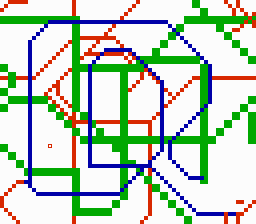
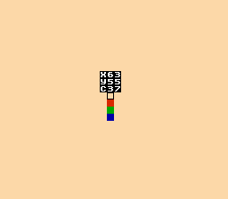

# Kalle Paint
A paint program for the NES (Nintendo Entertainment System). Written in 6502 assembly. Only tested on FCEUX. Assembles with [asm6f](https://github.com/freem/asm6f). The binary files (`.bin`, `.nes`) are in `bin.zip`.

## How to assemble
First, get the `.bin` files. Just extract them from `bin.zip` or encode them using the Python scripts:
* Install Python 3.
* Copy `nes_chr_encode.py` and its dependencies from my [NES utilities](https://github.com/qalle2/nes-util) repository.
* Create `background.bin`: `python3 gfx/background.py background.bin`
* Create `sprites.bin`: `python3 nes_chr_encode.py gfx/sprites.png sprites.bin`

Then, assemble:
* Go to the `src` directory.
* Run `asm6f paint.asm ../paint.nes`

Note: the Linux script `assemble` is intended for my personal use. Don't run it before reading it.

## Features
* 64&times;56 "pixels" (4&times;4 actual pixels each)
* 13 colors at the same time from the NES master palette
* 1&times;1-pixel or 2&times;2-pixel brush
* attribute editor
* palette editor

Due to NES hardware, the following restrictions apply to use of colors:
* There are four subpalettes with four colors each.
* The first color is shared between all subpalettes.
* If you think of the screen as a 16&times;16-pixel grid, each square can only use colors from one subpalette.

## How to use
There are three modes. Press select at any time to cycle between them.

### Paint mode

The program starts in this mode. You'll spend most of your time in it.

Buttons:
* up/down/left/right: move cursor
* start: toggle between small (1&times;1-pixel) and large (2&times;2-pixel) brush
* B: cycle through four paint colors
* A: paint at cursor using selected color and brush
* select: switch to attribute edit mode

### Attribute edit mode
This mode looks the same as the paint mode, except that the cursor is a large (16&times;16-pixel) blinking square.

Buttons:
* up/down/left/right: move cursor
* A: cycle through four subpalettes at cursor
* select: switch to palette edit mode

Note that pressing A has no visible effect on the image if you haven't painted anything on the selected square yet. (The default color is the same in every subpalette.)

### Palette edit mode

Indicators:
* `X`: current horizontal position of paint/attribute cursor (`00`&hellip;`63`; never changes inside palette edit mode)
* `Y`: current vertical position of paint/attribute cursor (`00`&hellip;`55`; never changes inside palette edit mode)
* `P`: subpalette being edited (`0`&hellip;`3`)
* `C`: NES color number of selected color in hexadecimal (`00`&hellip;`3F`)
* colored squares: selected subpalette
* blinking cursor: color being edited

Buttons:
* up/down: move cursor
* left/right: decrement/increment ones of color number
* B/A: decrement/increment 16s of color number
* start: cycle through four subpalettes (the topmost color is shared between all subpalettes)
* select: switch to paint mode

## Technical info
* mapper: NROM (iNES mapper number 0)
* PRG ROM: 2 KiB (padded to the end of 16 KiB because of iNES file format limitations)
* CHR ROM: 8 KiB
* name table mirroring: horizontal (does not really matter)
* save RAM: none
* compatibility: NTSC and PAL

## To do
* Python script to convert an image file into a FCEUX movie that draws the image
* test with other emulators

