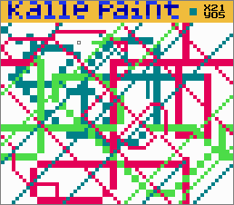

# Kalle Paint
A paint program for the NES (Nintendo Entertainment System). Written in 6502 assembly. Assembles with [asm6f](https://github.com/freem/asm6f). The compiled binary (.nes) is in `binary.zip`.

## Screenshot

## Features
* 64&times;50 "pixels" (4&times;4 actual pixels each)
* four colors at the same time (plus the GUI colors)
* palette editor
* 1&times;1-pixel or 2&times;2-pixel brush

## How to use
There are two modes: paint mode and palette edit mode.

Buttons in paint mode:
* arrows: move cursor
* start: toggle between small and large brush
* B: cycle through four paint colors
* A: paint using selected color and brush
* select: enter palette editor

Buttons in palette edit mode:
* up/down: move cursor
* left/right: decrement/increment ones of color number
* B/A: decrement/increment 16s of color number
* select: return to paint mode

