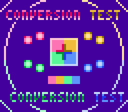

# Kalle Paint
A paint program for the Nintendo Entertainment System (NES). Written in 6502 assembly. Assembles with [ASM6](https://github.com/qalle2/asm6/). Tested on FCEUX and Mednafen. The assembled program (`.nes`) is in `paint.nes.gz`.

## How to assemble
* Get the background CHR data:
  * Either extract `chr-background.bin.gz`&hellip;
  * &hellip;or run `python3 chr-background-generate.py chr-background.bin`
* Get the sprite CHR data:
  * Either extract `chr-sprites.bin.gz`&hellip;
  * &hellip; or get `nes_chr_encode.py` and its dependencies from [my NES utilities](https://github.com/qalle2/nes-util) and run `python3 nes_chr_encode.py chr-sprites.png chr-sprites.bin`
* Assemble: run `asm6 paint.asm paint.nes`

Note: The Linux script `assemble.sh` is for my personal use only. Do not run it without reading it.

## Features
* 64&times;56 pixels (4&times;4 hardware pixels each)
* 13 colors simultaneously from the NES master palette
* 1&times;1-pixel or 2&times;2-pixel brush

Restrictions on color use:
* There are four subpalettes with four colors each.
* On an imaginary grid of 4&times;4 pixels, each square ("attribute block") can only use one subpalette.
* The first color is shared between all subpalettes. (Only the last three colors in each subpalette can be freely defined.)

By default, the screen is filled with the first color of the first subpalette.

## How to use
There are three modes. Press select at any time to cycle between them.

### Paint mode

The program starts in this mode. The cursor reflects the selected brush size and paint color.

Buttons:
* up/down/left/right: move cursor (hold down to move repeatedly)
* start: toggle between small and large brush (1&times;1 pixels and 2&times;2 pixels)
* B: change paint color (0 &rarr; 1 &rarr; 2 &rarr; 3 &rarr; 0)
* A: paint at cursor using selected color and brush
* select: switch to attribute edit mode

Note: the cursor is invisible if it is on a pixel of the same color.

Hint: to move long distances faster, switch to the large brush.

### Attribute edit mode

This mode looks like the paint mode except that the cursor is a large blinking square (4&times;4 pixels).

Buttons:
* up/down/left/right: move cursor
* B/A: decrement/increment subpalette at cursor (0/1/2/3)
* select: switch to palette edit mode

Note: changing the subpalette has no visible effect if the selected square only contains the first color of a subpalette. (That color is shared between all subpalettes.)

### Palette edit mode

The palette editor is a small black window at the bottom right corner of the screen.

Indicators:
* `P`: number of subpalette being edited (`0`&ndash;`3`)
* `C`: NES color number of selected color in hexadecimal (`00`&ndash;`3F`); the first digit roughly corresponds to brightness (dark/light) and the second one to hue (red/green/etc.)
* colored squares: colors in selected subpalette
* blinking cursor: highlights the color being edited

Buttons:
* start: increment subpalette (0 &rarr; 1 &rarr; 2 &rarr; 3 &rarr; 0)
* up/down: move cursor
* left/right: decrement/increment ones of color number
* B/A: decrement/increment 16s of color number
* select: switch to paint mode

Note: the first (topmost) color is shared between all subpalettes.

## Technical info
* mapper: NROM (iNES mapper number 0)
* PRG ROM: 16 KiB
* CHR ROM: 8 KiB
* name table mirroring: vertical
* save RAM: none
* compatibility: NTSC and PAL

## To do
* test with other emulators
* a Python script to convert an image file into an FCEUX movie that draws the image
